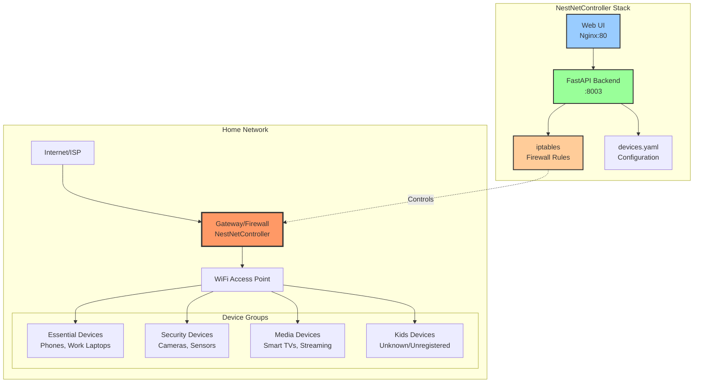

# NestNetController 🏠

> Family-friendly network firewall manager with device grouping and web UI

[](https://opensource.org/licenses/MIT)
[](https://www.docker.com/)
[](CONTRIBUTING.md)

**NestNetController** is a lightweight, Docker-based network firewall manager designed for families. It provides a simple web interface to control internet access for different device groups in your home network, with built-in safety features and dry-run testing mode.

---

## ✨ Features

- 🎯 **Device Grouping** - Organize devices by MAC address into logical groups (Essential, Security, Media, Kids)
- 🔒 **Easy Control** - Simple web UI to enable/disable internet access per group
- ⚡ **Quick Actions** - One-click presets like "Only Essential + Security" for bedtime or focused work
- 🧪 **Safe Testing** - Dry-run mode to test without affecting your network
- 📊 **Activity Logs** - Track who blocked/unblocked what and when
- 🐳 **Docker Ready** - Simple deployment with docker-compose
- 🔐 **Protected Groups** - Infrastructure devices (routers, switches) are never blocked
- 🛡️ **Guaranteed Panel Access** - The control panel stays reachable from your LAN (and via WireGuard) no matter what gets blocked

---

## 🏗️ Architecture



**How it works:**
1. Gateway runs NestNetController with Docker
2. FastAPI backend manages iptables firewall rules
3. Web UI provides simple control interface
4. Device groups defined by MAC address in YAML config
5. **Default-deny model:** only devices listed in `devices.yaml` can reach the internet at all. On every app startup (and every "Reload Config"), the backend syncs an ACCEPT rule per known MAC and relies on the `FORWARD` chain's default DROP policy to block everything else — including unregistered/unknown devices, with no separate action needed
6. Group blocking/unblocking (Quick Actions, toggles) adds/removes temporary DROP rules on top of the allowlist, taking priority over it
7. A separate host-level failsafe rule guarantees the control panel itself is always reachable, independent of any group/device blocking or the allowlist sync (see [Guaranteed Panel Access](#-guaranteed-panel-access-failsafe) below)

---

## 🚀 Quick Start

### Prerequisites

- Linux system (Debian, Ubuntu, or similar)
- Docker and Docker Compose
- Root/sudo access for firewall management
- Gateway/router running Linux

### Installation

1. **Clone the repository:**
```bash
git clone https://github.com/zekefarioli-arch/NestNetController.git
cd NestNetController
```

2. **Configure environment:**
```bash
cp .env.example .env
nano .env
```

Edit `.env` with your network settings:
```env
WAN_INTERFACE=eth0      # Your internet-facing interface
LAN_INTERFACE=eth1      # Your local network interface
DRY_RUN=true           # Keep true for testing!
ADMIN_USERNAME=admin
ADMIN_PASSWORD=ChangeThisPassword123
JWT_SECRET=generate-a-long-random-secret-here
```

> ⚠️ **Double-check `WAN_INTERFACE` against reality**, not just `ip addr show`. On multi-NIC gateways it's easy to have a stale or unused interface (e.g. a disabled `eth1`) while the actual LAN traffic flows over a different one (e.g. `enp7s0f0`). Confirm with `ip -brief link show` and `iptables -L FORWARD -v -n` (see [Network Interfaces](#network-interfaces)) before trusting the `.env` defaults — `firewall.py` only reads `WAN_INTERFACE` for blocking, so getting that one right matters most.

3. **Configure devices:**
```bash
nano config/devices.yaml
```

Add your actual devices with real MAC addresses:
```yaml
groups:
  essential:
    description: "Critical devices that should always have internet"
    devices:
      - name: "dad_phone"
        mac: "AA:BB:CC:DD:EE:01"
        description: "Dad's work phone"
      - name: "mom_laptop"
        mac: "AA:BB:CC:DD:EE:02"
        description: "Mom's laptop"
  
  security:
    description: "Security cameras and monitoring devices"
    devices:
      - name: "front_camera"
        mac: "AA:BB:CC:DD:EE:03"
        description: "Front door camera"
  
  media:
    description: "Entertainment devices"
    devices:
      - name: "living_tv"
        mac: "AA:BB:CC:DD:EE:04"
        description: "Living room Smart TV"
  
  infrastructure:
    description: "Network infrastructure - NEVER BLOCKED"
    protected: true
    devices:
      - name: "gateway_lan"
        mac: "AA:BB:CC:DD:EE:F1"
        description: "Gateway LAN interface"
      - name: "main_router"
        mac: "AA:BB:CC:DD:EE:F2"
        description: "Main WiFi router/AP"
```

> ⚠️ **YAML indentation matters here.** Every key under a group (`description`, `protected`, `devices`) must be indented *inside* that group, not aligned with the group name itself. A misindented `infrastructure:` or `kids:` block silently breaks that group — it either loads as `null` or gets hoisted to the wrong level in `groups`. After editing, always verify with:
> ```bash
> docker exec nestnet-api python3 -c "from app.services.device_service import device_service; print(device_service.load_groups())"
> ```
> and confirm each group (especially `infrastructure`) shows the devices and `protected` value you expect.

**Finding MAC addresses:**
```bash
# On the gateway, see all connected devices:
sudo arp -a

# Or check network neighbors:
ip neigh show
```

4. **Start in dry-run mode (safe testing):**
```bash
docker compose up -d
```

5. **Access the web UI:**

Open in your browser: `http://YOUR_GATEWAY_IP:3002`

Default login: `admin` / `ChangeThisPassword123`

> 🛡️ This URL is designed to stay reachable even if a Quick Action blocks every device group, thanks to the host-level failsafe rule below — but only once you've set it up. New installs should configure it before going to production (step below).

---

## 🛡️ Guaranteed Panel Access (Failsafe)

The whole point of this tool is to be able to cut a device's internet access — which means the one thing that must **never** get cut by accident is your own access to the panel that controls it. This is handled at two levels:

### Level 1: App-level design (already built in)

`firewall.py` only ever writes rules to the `FORWARD` chain, scoped to `-o $WAN_INTERFACE` (i.e. "traffic leaving towards the internet"). It never touches `INPUT`. This means device blocking only affects a device's *outbound internet access* — it was never capable of blocking access to the gateway's own local services (like the panel) in the first place. No configuration needed for this part.

### Level 2: Host-level failsafe rule (recommended, one-time setup)

Depending on how your reverse proxy/UI container is networked, panel traffic can also pass through Docker's own `FORWARD`-adjacent chains (`DOCKER`, `DOCKER-USER`) rather than plain `INPUT` — for example when the UI container is port-mapped instead of using `network_mode: host`. To guarantee access regardless of network topology changes (new switches, new NICs, VPN interfaces), add one rule directly on the **host**, in Docker's `DOCKER-USER` chain — the only chain Docker guarantees it will never rewrite automatically:

```bash
sudo iptables -I DOCKER-USER 1 ! -i $WAN_INTERFACE -p tcp --dport 3002 -j ACCEPT
```

Replace `$WAN_INTERFACE` with your actual WAN interface (e.g. `ppp0`). This rule reads: *"any traffic to the panel port that does NOT come from the WAN, gets accepted"* — regardless of which LAN interface, switch, or bridge it arrives on. That includes:
- Any current or future LAN interface/switch
- Docker bridge networks
- A WireGuard tunnel (`wg0` or a WireGuard container's bridge) when connecting remotely — no need to name it explicitly, since it's simply "not the WAN"

**Make it persistent** so it survives a gateway reboot:
```bash
sudo apt install iptables-persistent   # if not already installed
sudo netfilter-persistent save
```

**Verify it's active and first in line:**
```bash
sudo iptables -L DOCKER-USER -v -n --line-numbers
```

**Test from another device on the LAN:**
```bash
curl -I http://YOUR_GATEWAY_IP:3002
# Expect: HTTP/1.1 200 OK
```

This rule is intentionally set up **outside of Docker and outside this repo** (directly on the host, saved via `netfilter-persistent`) so it keeps working even if Docker itself fails to start, the compose stack breaks, or a future bug gets introduced in `firewall.py`. Authentication (username/password + JWT) remains the only real gate on *who* can act once they reach the panel — this rule only guarantees *reachability*.

---

## 📖 Usage

### Web Interface

The dashboard shows:
- **Quick Actions** - One-click presets for common scenarios
- **Device Groups** - Status and control for each group
- **Activity Log** - History of all actions

### Quick Actions

- **🚨 Only Essential + Security** - Block everything except essential devices and cameras (great for bedtime)
- **⚡ Only Essential** - Block everything except essential devices (deep focus mode)
- **✅ Enable All** - Restore full network access to all groups
- **🔄 Reload Config** - Reload device configuration from disk

### Managing Groups

Each group card shows:
- Group name and description
- Number of devices
- Current status (Active/Blocked)
- Enable/Block button (protected groups show 🔒)

### Dry-Run Mode

**IMPORTANT:** Always test in dry-run mode first!

When `DRY_RUN=true`, the system:
- ✅ Shows what iptables commands it would run
- ✅ Logs all actions
- ❌ Does NOT actually modify firewall rules

Check logs to verify behavior:
```bash
docker logs nestnet-api
```

You should see:
```
[DRY-RUN] Blocking device dad_phone (AA:BB:CC:DD:EE:01)
[DRY-RUN] Unblocking device mom_laptop (AA:BB:CC:DD:EE:02)
```

### Going to Production

When ready to use for real:

1. **Set up the panel-access failsafe first** (see [Guaranteed Panel Access](#-guaranteed-panel-access-failsafe)) — do this *before* flipping dry-run off, so you're never testing real blocking without a safety net already in place.

2. **Set dry-run to false:**
```bash
nano .env
# Change: DRY_RUN=false
```

3. **Restart containers:**
```bash
docker compose down
docker compose up -d
```

4. **Test carefully:**
   - Start with a non-critical device
   - Block it and verify connectivity is cut
   - Unblock and verify connectivity restores
   - From another device (and, if possible, over WireGuard from outside), confirm the panel itself is still reachable
   - Check logs for any errors

---

## 🔧 Configuration

### Network Interfaces

**Finding your interfaces:**
```bash
ip addr show
ip route | grep default
```

**Confirm which interface is actually carrying traffic** (don't rely on `.env` defaults alone):
```bash
ip -brief link show
sudo iptables -L FORWARD -v -n --line-numbers
```
Look for the interface with non-zero packet counters in `FORWARD` — that's your real LAN interface, even if a different one is configured or wired up.

Common setups:
- **Router/Gateway:** WAN=`eth0`, LAN=`eth1`
- **PPPoE Connection:** WAN=`ppp0`, LAN=`eth0`
- **USB Network:** May show as `enx...` or similar
- **Multi-NIC gateway:** may have unused/disabled interfaces present (`DOWN` in `ip -brief link show`) alongside the active one — always verify with the commands above rather than assuming

### Default-Deny Model (Allowlist)

**Only devices listed anywhere in `devices.yaml` can reach the internet.** This is enforced automatically:

- On every backend startup, and every time "Reload Config" is triggered, `sync_allowlist()` removes the broad LAN→WAN accept rule and replaces it with one `ACCEPT` rule per known MAC address (tagged with a `nestnet-allow` comment so re-syncs don't duplicate rules)
- Any device **not** present in `devices.yaml` — a visitor's phone, an unregistered IoT gadget, anything new — is blocked by the `FORWARD` chain's default `DROP` policy, with no extra configuration needed
- Group blocking (Quick Actions, individual toggles) still works exactly as before — those add temporary `DROP` rules that take priority over the allowlist

**Practical implication:** if you add a new device to your network, it has **no internet access until you add its MAC to `devices.yaml`** and reload the config (or restart the container). This is the entire point of the model — but it does mean guests, new IoT purchases, etc. need a deliberate step before they'll work.

```bash
# After adding a device to devices.yaml:
curl -X POST -u admin:yourpassword http://localhost:8003/devices/reload
# or just click "Reload Config" in the web UI
```

### Device Groups

Groups are defined in `config/devices.yaml`. Each group has:
- **name** - Unique identifier (essential, security, media, infrastructure, kids)
- **description** - Human-readable description
- **devices** - List of devices with MAC addresses
- **protected** - If true, cannot be blocked (infrastructure only)

**Special Groups:**
- **infrastructure** - Network equipment, always protected
- **kids** - Auto-populated with unknown devices (future feature)

> ⚠️ Both special groups are easy to misconfigure via YAML indentation — see the warning under [Installation, step 3](#installation) and always confirm with `device_service.load_groups()` after editing.

### Panel Access vs. Device Protection — two different things

It's worth being explicit about this, since they're easy to conflate:

| | **Protected devices** (`infrastructure` group) | **Panel access failsafe** (`DOCKER-USER` rule) |
|---|---|---|
| Purpose | Stops your router/AP/switches from losing **their own** internet access | Guarantees **any** device can always reach the control panel |
| Scope | Only devices explicitly listed by MAC | Universal — no device list needed |
| Where it lives | `config/devices.yaml` | Host iptables (`DOCKER-USER` chain), outside the app |
| What breaks it | Wrong/missing MAC in the list | N/A — doesn't depend on device identity at all |

You do **not** need to list every device that should be able to reach the panel. The failsafe rule works by excluding only the WAN interface, so it covers every LAN device, every future switch/NIC, and WireGuard connections automatically.

### Security Settings

**Change default credentials immediately:**
```bash
nano .env
# Update ADMIN_PASSWORD and JWT_SECRET
```

**Use strong passwords:**
- At least 12 characters
- Mix of letters, numbers, symbols
- Avoid common words

**JWT Secret:**
```bash
# Generate a secure random secret:
openssl rand -hex 32
```

---

## 🛠️ Development

### Project Structure

```
NestNetController/
├── backend/              # FastAPI application
│   ├── app/
│   │   ├── models/       # Pydantic models
│   │   ├── services/     # Business logic
│   │   │   ├── firewall.py    # iptables management
│   │   │   ├── auth.py        # Authentication
│   │   │   └── device_service.py  # Device config
│   │   └── routers/      # API endpoints
│   ├── Dockerfile
│   └── requirements.txt
├── frontend/             # Static HTML/JS UI
│   ├── static/js/
│   ├── templates/
│   ├── Dockerfile
│   └── nginx.conf
├── config/               # Device configuration
│   └── devices.yaml
├── logs/                 # Activity logs
├── docker-compose.yml
└── README.md
```

### Running Locally

```bash
# Start with logs visible
docker compose up

# Rebuild after code changes
docker compose up --build

# Run in background
docker compose up -d

# View logs
docker logs nestnet-api
docker logs nestnet-ui

# Stop everything
docker compose down
```

### Adding Features

See [CONTRIBUTING.md](CONTRIBUTING.md) for development guidelines.

**Current tech stack:**
- **Backend:** Python 3.11, FastAPI, iptables
- **Frontend:** HTML, Tailwind CSS, Vanilla JavaScript
- **Infrastructure:** Docker, Nginx, Docker Compose

---

## 🐛 Troubleshooting

### Container won't start

**Check Docker is running:**
```bash
sudo systemctl status docker
sudo systemctl start docker
```

**Check logs:**
```bash
docker compose logs
```

### Backend keeps restarting

**Port conflict (8003 already in use):**
```bash
# Find what's using the port:
sudo lsof -i :8003

# Change the port in backend/Dockerfile:
CMD ["uvicorn", "app.main:app", "--host", "0.0.0.0", "--port", "8004"]
```

### Can't access UI

**Check the host-level failsafe rule is present and first in `DOCKER-USER`:**
```bash
sudo iptables -L DOCKER-USER -v -n --line-numbers
```
If it's missing, see [Guaranteed Panel Access](#-guaranteed-panel-access-failsafe) to add it back.

**Check firewall rules allow port 3002:**
```bash
sudo iptables -L INPUT -v -n | grep 3002
sudo iptables -L FORWARD -v -n | grep 3002
```

**Access from gateway itself:**
```bash
curl http://localhost:3002
```

### Rules not applying

**Verify dry-run mode is disabled:**
```bash
docker exec nestnet-api env | grep DRY_RUN
# Should show: DRY_RUN=false
```

**Check iptables rules:**
```bash
sudo iptables -L FORWARD -v -n
```

### Locked yourself out

If you've set up the [panel-access failsafe](#-guaranteed-panel-access-failsafe), this shouldn't happen — the panel stays reachable regardless of device/group blocking. If you still can't reach it:

**SSH into gateway and reset:**
```bash
docker compose down
sudo iptables -P FORWARD ACCEPT
sudo iptables -F FORWARD
```

**Or from console:**
```bash
cd ~/projects/NestNetController
docker compose down
```

**If even that fails**, the `DOCKER-USER` failsafe rule (being independent of the compose stack and of `FORWARD`) should still let you reach the panel to diagnose from there — this is exactly the scenario it's designed for.

---

## 🗺️ Roadmap

### ✅ Completed (v1.0)
- [x] FastAPI backend with iptables integration
- [x] Web UI with login and authentication
- [x] Device group management
- [x] Quick actions
- [x] Activity logging
- [x] Dry-run testing mode
- [x] Docker containerization
- [x] Guaranteed, device-list-independent panel access (host-level failsafe)
- [x] Default-deny firewall model — only devices in devices.yaml get internet access

### 🚧 In Progress
- [ ] Fix config volume mounting issue
- [ ] Add dry-run mode badge to UI
- [ ] Improve error handling and user feedback
- [ ] Automate failsafe rule setup (install script instead of manual `iptables` command)

### 📋 Planned Features
- [ ] Auto-detection of unknown devices (kids group)
- [ ] Scheduling (automatic rules by time of day)
- [ ] Usage statistics and reporting
- [ ] Mobile app (React Native)
- [ ] Multi-user support with permissions
- [ ] Integration with Home Assistant
- [ ] Bandwidth throttling (QoS)
- [ ] Notifications (email, Slack, Discord)
- [ ] Backup and restore configuration
- [ ] API documentation (Swagger/OpenAPI)

---

## 🤝 Contributing

Contributions are welcome! Please read [CONTRIBUTING.md](CONTRIBUTING.md) for guidelines.

**Ways to contribute:**
- 🐛 Report bugs
- 💡 Suggest features
- 📖 Improve documentation
- 🔧 Submit pull requests
- ⭐ Star the repo if you find it useful!

---

## 📄 License

This project is licensed under the MIT License - see the [LICENSE](LICENSE) file for details.

---

## 🙏 Acknowledgments

- Built for families who want simple, safe network control
- Inspired by the need for parental controls without expensive hardware
- Thanks to the open-source community for the tools that made this possible

---

## 📞 Support

- **Issues:** [GitHub Issues](https://github.com/zekefarioli-arch/NestNetController/issues)
- **Discussions:** [GitHub Discussions](https://github.com/zekefarioli-arch/NestNetController/discussions)

---

## ⚠️ Disclaimer

This software is provided "as is" without warranty. Use at your own risk. Always test in dry-run mode before deploying to production. The authors are not responsible for any network disruptions or connectivity issues.

**Security Note:** This tool requires privileged access to modify firewall rules. Ensure proper authentication and keep your admin credentials secure. The panel-access failsafe rule guarantees *reachability*, not *authorization* — login credentials remain the only real access control. With the default-deny allowlist model active, an incomplete `devices.yaml` (missing MACs) will cut internet access for those devices — always verify new/changed hardware is added before relying on it.

---

Made with ❤️ for families who want better control of their home network.