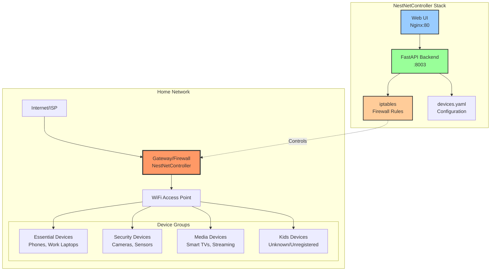

# NestNetController 🏠

> Family-friendly network firewall manager with device grouping and web UI

[](https://opensource.org/licenses/MIT)
[](https://www.docker.com/)
[](CONTRIBUTING.md)

**NestNetController** is a lightweight, Docker-based network firewall manager designed for families. It provides a simple web interface to control internet access for different device groups in your home network, with built-in safety features and dry-run testing mode.

---

## ✨ Features

- 🎯 **Device Grouping** - Organize devices by MAC address into logical groups (Essential, Security, Media, Kids)
- 🔒 **Easy Control** - Simple web UI to enable/disable internet access per group
- ⚡ **Quick Actions** - One-click presets like "Only Essential + Security" for bedtime or focused work
- 🧪 **Safe Testing** - Dry-run mode to test without affecting your network
- 📊 **Activity Logs** - Track who blocked/unblocked what and when
- 🐳 **Docker Ready** - Simple deployment with docker-compose
- 🔐 **Protected Groups** - Infrastructure devices (routers, switches) are never blocked

---

## 🏗️ Architecture



**How it works:**
1. Gateway runs NestNetController with Docker
2. FastAPI backend manages iptables firewall rules
3. Web UI provides simple control interface
4. Device groups defined by MAC address in YAML config
5. Firewall blocks/unblocks based on group status

---

## 🚀 Quick Start

### Prerequisites

- Linux system (Debian, Ubuntu, or similar)
- Docker and Docker Compose
- Root/sudo access for firewall management
- Gateway/router running Linux

### Installation

1. **Clone the repository:**
```bash
git clone https://github.com/zekefarioli-arch/NestNetController.git
cd NestNetController
```

2. **Configure environment:**
```bash
cp .env.example .env
nano .env
```

Edit `.env` with your network settings:
```env
WAN_INTERFACE=eth0      # Your internet-facing interface
LAN_INTERFACE=eth1      # Your local network interface
DRY_RUN=true           # Keep true for testing!
ADMIN_USERNAME=admin
ADMIN_PASSWORD=ChangeThisPassword123
JWT_SECRET=generate-a-long-random-secret-here
```

3. **Configure devices:**
```bash
nano config/devices.yaml
```

Add your actual devices with real MAC addresses:
```yaml
groups:
  essential:
    description: "Critical devices that should always have internet"
    devices:
      - name: "dad_phone"
        mac: "AA:BB:CC:DD:EE:01"
        description: "Dad's work phone"
      - name: "mom_laptop"
        mac: "AA:BB:CC:DD:EE:02"
        description: "Mom's laptop"
  
  security:
    description: "Security cameras and monitoring devices"
    devices:
      - name: "front_camera"
        mac: "AA:BB:CC:DD:EE:03"
        description: "Front door camera"
  
  media:
    description: "Entertainment devices"
    devices:
      - name: "living_tv"
        mac: "AA:BB:CC:DD:EE:04"
        description: "Living room Smart TV"
  
  infrastructure:
    description: "Network infrastructure - NEVER BLOCKED"
    protected: true
    devices:
      - name: "gateway_lan"
        mac: "AA:BB:CC:DD:EE:F1"
        description: "Gateway LAN interface"
      - name: "main_router"
        mac: "AA:BB:CC:DD:EE:F2"
        description: "Main WiFi router/AP"
```

**Finding MAC addresses:**
```bash
# On the gateway, see all connected devices:
sudo arp -a

# Or check network neighbors:
ip neigh show
```

4. **Start in dry-run mode (safe testing):**
```bash
docker compose up -d
```

5. **Access the web UI:**

Open in your browser: `http://YOUR_GATEWAY_IP:3002`

Default login: `admin` / `ChangeThisPassword123`

---

## 📖 Usage

### Web Interface

The dashboard shows:
- **Quick Actions** - One-click presets for common scenarios
- **Device Groups** - Status and control for each group
- **Activity Log** - History of all actions

### Quick Actions

- **🚨 Only Essential + Security** - Block everything except essential devices and cameras (great for bedtime)
- **⚡ Only Essential** - Block everything except essential devices (deep focus mode)
- **✅ Enable All** - Restore full network access to all groups
- **🔄 Reload Config** - Reload device configuration from disk

### Managing Groups

Each group card shows:
- Group name and description
- Number of devices
- Current status (Active/Blocked)
- Enable/Block button (protected groups show 🔒)

### Dry-Run Mode

**IMPORTANT:** Always test in dry-run mode first!

When `DRY_RUN=true`, the system:
- ✅ Shows what iptables commands it would run
- ✅ Logs all actions
- ❌ Does NOT actually modify firewall rules

Check logs to verify behavior:
```bash
docker logs nestnet-api
```

You should see:
```
[DRY-RUN] Blocking device dad_phone (AA:BB:CC:DD:EE:01)
[DRY-RUN] Unblocking device mom_laptop (AA:BB:CC:DD:EE:02)
```

### Going to Production

When ready to use for real:

1. **Set dry-run to false:**
```bash
nano .env
# Change: DRY_RUN=false
```

2. **Restart containers:**
```bash
docker compose down
docker compose up -d
```

3. **Test carefully:**
   - Start with a non-critical device
   - Block it and verify connectivity is cut
   - Unblock and verify connectivity restores
   - Check logs for any errors

---

## 🔧 Configuration

### Network Interfaces

**Finding your interfaces:**
```bash
ip addr show
ip route | grep default
```

Common setups:
- **Router/Gateway:** WAN=`eth0`, LAN=`eth1`
- **PPPoE Connection:** WAN=`ppp0`, LAN=`eth0`
- **USB Network:** May show as `enx...` or similar

### Device Groups

Groups are defined in `config/devices.yaml`. Each group has:
- **name** - Unique identifier (essential, security, media, infrastructure, kids)
- **description** - Human-readable description
- **devices** - List of devices with MAC addresses
- **protected** - If true, cannot be blocked (infrastructure only)

**Special Groups:**
- **infrastructure** - Network equipment, always protected
- **kids** - Auto-populated with unknown devices (future feature)

### Security Settings

**Change default credentials immediately:**
```bash
nano .env
# Update ADMIN_PASSWORD and JWT_SECRET
```

**Use strong passwords:**
- At least 12 characters
- Mix of letters, numbers, symbols
- Avoid common words

**JWT Secret:**
```bash
# Generate a secure random secret:
openssl rand -hex 32
```

---

## 🛠️ Development

### Project Structure

```
NestNetController/
├── backend/              # FastAPI application
│   ├── app/
│   │   ├── models/       # Pydantic models
│   │   ├── services/     # Business logic
│   │   │   ├── firewall.py    # iptables management
│   │   │   ├── auth.py        # Authentication
│   │   │   └── device_service.py  # Device config
│   │   └── routers/      # API endpoints
│   ├── Dockerfile
│   └── requirements.txt
├── frontend/             # Static HTML/JS UI
│   ├── static/js/
│   ├── templates/
│   ├── Dockerfile
│   └── nginx.conf
├── config/               # Device configuration
│   └── devices.yaml
├── logs/                 # Activity logs
├── docker-compose.yml
└── README.md
```

### Running Locally

```bash
# Start with logs visible
docker compose up

# Rebuild after code changes
docker compose up --build

# Run in background
docker compose up -d

# View logs
docker logs nestnet-api
docker logs nestnet-ui

# Stop everything
docker compose down
```

### Adding Features

See [CONTRIBUTING.md](CONTRIBUTING.md) for development guidelines.

**Current tech stack:**
- **Backend:** Python 3.11, FastAPI, iptables
- **Frontend:** HTML, Tailwind CSS, Vanilla JavaScript
- **Infrastructure:** Docker, Nginx, Docker Compose

---

## 🐛 Troubleshooting

### Container won't start

**Check Docker is running:**
```bash
sudo systemctl status docker
sudo systemctl start docker
```

**Check logs:**
```bash
docker compose logs
```

### Backend keeps restarting

**Port conflict (8003 already in use):**
```bash
# Find what's using the port:
sudo lsof -i :8003

# Change the port in backend/Dockerfile:
CMD ["uvicorn", "app.main:app", "--host", "0.0.0.0", "--port", "8004"]
```

### Can't access UI

**Check firewall rules allow port 3002:**
```bash
sudo iptables -L INPUT -v -n | grep 3002
```

**Access from gateway itself:**
```bash
curl http://localhost:3002
```

### Rules not applying

**Verify dry-run mode is disabled:**
```bash
docker exec nestnet-api env | grep DRY_RUN
# Should show: DRY_RUN=false
```

**Check iptables rules:**
```bash
sudo iptables -L FORWARD -v -n
```

### Locked yourself out

**SSH into gateway and reset:**
```bash
docker compose down
sudo iptables -P FORWARD ACCEPT
sudo iptables -F FORWARD
```

**Or from console:**
```bash
cd ~/projects/NestNetController
docker compose down
```

---

## 🗺️ Roadmap

### ✅ Completed (v1.0)
- [x] FastAPI backend with iptables integration
- [x] Web UI with login and authentication
- [x] Device group management
- [x] Quick actions
- [x] Activity logging
- [x] Dry-run testing mode
- [x] Docker containerization

### 🚧 In Progress
- [ ] Fix config volume mounting issue
- [ ] Add dry-run mode badge to UI
- [ ] Improve error handling and user feedback

### 📋 Planned Features
- [ ] Auto-detection of unknown devices (kids group)
- [ ] Scheduling (automatic rules by time of day)
- [ ] Usage statistics and reporting
- [ ] Mobile app (React Native)
- [ ] Multi-user support with permissions
- [ ] Integration with Home Assistant
- [ ] Bandwidth throttling (QoS)
- [ ] Notifications (email, Slack, Discord)
- [ ] Backup and restore configuration
- [ ] API documentation (Swagger/OpenAPI)

---

## 🤝 Contributing

Contributions are welcome! Please read [CONTRIBUTING.md](CONTRIBUTING.md) for guidelines.

**Ways to contribute:**
- 🐛 Report bugs
- 💡 Suggest features
- 📖 Improve documentation
- 🔧 Submit pull requests
- ⭐ Star the repo if you find it useful!

---

## 📄 License

This project is licensed under the MIT License - see the [LICENSE](LICENSE) file for details.

---

## 🙏 Acknowledgments

- Built for families who want simple, safe network control
- Inspired by the need for parental controls without expensive hardware
- Thanks to the open-source community for the tools that made this possible

---

## 📞 Support

- **Issues:** [GitHub Issues](https://github.com/zekefarioli-arch/NestNetController/issues)
- **Discussions:** [GitHub Discussions](https://github.com/zekefarioli-arch/NestNetController/discussions)

---

## ⚠️ Disclaimer

This software is provided "as is" without warranty. Use at your own risk. Always test in dry-run mode before deploying to production. The authors are not responsible for any network disruptions or connectivity issues.

**Security Note:** This tool requires privileged access to modify firewall rules. Ensure proper authentication and keep your admin credentials secure.

---

Made with ❤️ for families who want better control of their home network.